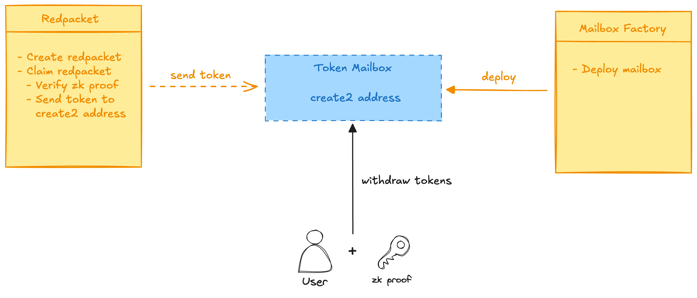

# 框架设计

## 合约业务逻辑

合约的业务逻辑主要如下：

- 红包 claim 时，会传入 wechat username hash 和对应的 zk proof，红包使用 username hash 作为 salt 来计算 `create2`的地址，并向其中转账 token。
- 用户如需提款，可以自己搞一个钱包，跟`MailboxFactory`交互以部署`Token Mailbox`到上一步中计算出的地址。
- 用户使用 commit 了自己新地址的 zk proof 去跟`Token Mailbox`合约交互，以提取自己的代币。

如下图

## 合约实现

### circuit

circuit 方面会包含如下 component：

- 对于`tencent.com`发出的 email 的验证(dkim signature).
- 解析出特定 regex 匹配到的邮件中的用户的 wechat username， 此处会做 poseidon hash 的处理，以避免在与合约交互的过程中，将用户的 username 泄露在链上。
- 将 `ethereum address` 添加到 circuit 中, 这将以 input signal 的形式，但我们目前无需为其施加约束。这相当于我们只是在 proof 的生成过程中 commit 了这个 ethereum address。

### 合约

#### 红包合约

zk-wechat-redpacket 是基于原始的[普通红包合约](https://github.com/DimensionDev/RedPacket/blob/master/contracts/redpacket.sol)设计的，只是针对 zk 的逻辑增加了验证，以及一些代码优化。

**发红包**：

- 接受 Native Token 和 ERC20 Token 两种类型的代币
- 支持设置红包类型：均分型红包 和 随机型红包
- 需要设置红包的过期时间，有效期内可以领取红包，**过期后**红包的创建者才可以收回没有发完的红包。

**领红包**：

- 用户需要在与合约交互前，由前端生成 zk proof of wechat，其中 proof 中需要 commit 用户接收 token 的地址。
- 接收 token 的地址，实际上是根据`create2`计算出来的，使用`Token Mailbox`的`initCode`， 用户的`username hash`作为 salt 来计算的地址。（注：此时`Token Mailbox`并不需要被部署）
- 领完红包后，已经验证过的 wechat username hash 会被标记为已经领取过，这样这个微信号就不可以再领取该红包了。
- 需要注意的是，这里特意设计了 proof 的通用性的情况，对于相同的`domain`和`recipient address`，用户无需重复生成 proof。 如果需要考虑其专用性，那么需要在 circuit 中添加`packetId`之类的参数。

#### Token Mailbox 合约

`Token Mailbox`合约是被一个`Mailbox Factory`部署的，部署的地址必须与之前使用`username hash`作为 salt 来计算的一致。`Token Mailbox`合约仅完成一件事，允许用户使用证明自己 wechat username 的 zk proof 来 提取自己的 token。
